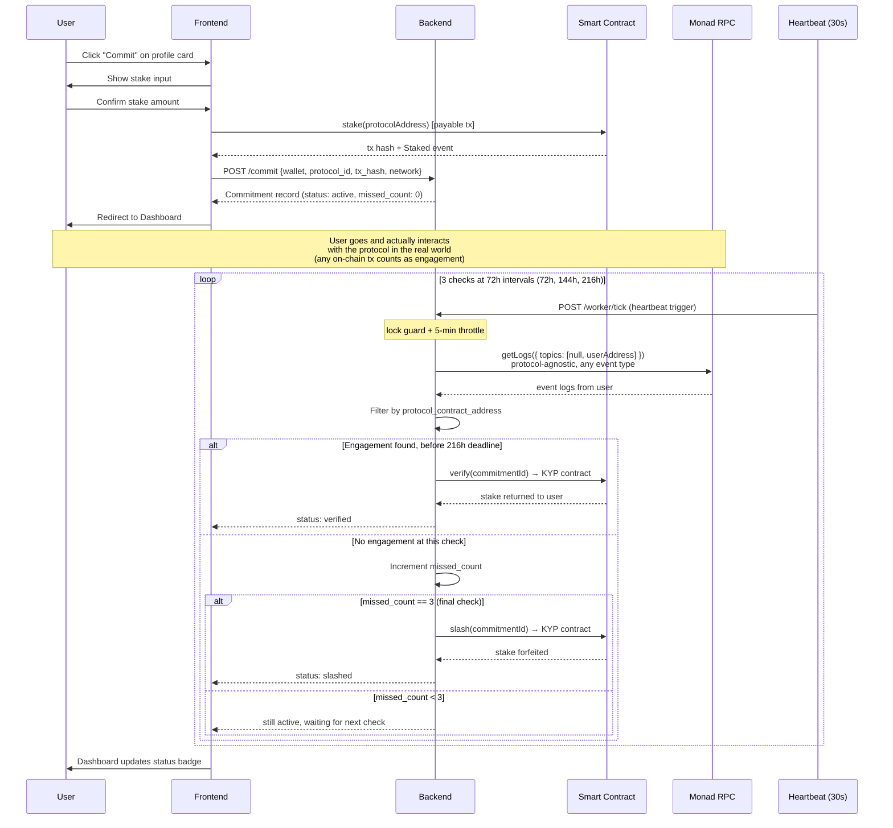

# KYP — Architecture

## Data Models

### Protocol Research Record

```json
{
  "id": "slug-network (e.g. kuru-testnet, kuru-mainnet)",
  "name": "Kuru",
  "image": "https://...",
  "chain": "monad",
  "network": "mainnet | testnet",
  "category": "DeFi",
  "subcategory": "DEX",
  "contracts": [
    { "name": "Kuru", "address": "0x...", "type": "DEX" }
  ],
  "links": {
    "project": "url | null",
    "twitter": "url | null",
    "discord": "url | null",
    "github": "url | null"
  },
  "contract_verified": "boolean | null",
  "score": 42,
  "score_max": 50,
  "plain_summary": "1-3 sentence human-readable description",
  "summary": "concise protocol overview",
  "who_its_for": "1-2 sentence string",
  "who_its_not_for": "1-2 sentence string | null",
  "use_cases": ["string", "string"],
  "risks": {
    "contract": "string | null",
    "community": "string | null",
    "structural": "string | null"
  },
  "forensics": {
    "has_admin_functions": "boolean | null",
    "admin_function_notes": "string",
    "deployer_wallet_age": "string",
    "deployer_prior_deploys": "number | null",
    "top_10_holder_concentration_pct": "number | null"
  },
  "funding": {
    "has_funding_info": "boolean | null",
    "investors": ["string"],
    "source_note": "string"
  },
  "founder_history": {
    "prior_projects_found": "boolean | null",
    "details": "string",
    "confidence_note": "string"
  },
  "team": [{"name": "string", "role": "string"}],
  "team_as_of": "timestamp | null",
  "deployed_date": "timestamp | null",
  "age_summary": "string | null",
  "restricted_jurisdictions": ["US"],
  "created_at": "timestamp",
  "created_by_wallet": "string | null"
}
```

**ID scheme:** `slugify(name) + "-" + network` — e.g., `kuru-testnet`, `kuru-mainnet`. This prevents collisions when the same protocol exists on both networks. The same protocol has **two separate records** — one per network — each with the correct contract address for that chain.

**`contracts` array:** Each entry has `{ name, address, type }`. The `address` is the protocol's deployed contract on the specific network this record represents. This is what gets passed as `protocol_contract_address` in commitment records.

### Commitment Record

```json
{
  "id": "uuid",
  "user_wallet": "string",
  "chain": "monad",
  "network": "testnet | mainnet",
  "protocol_id": "slug-network (fk -> protocol record)",
  "protocol_contract_address": "0x... (protocol's contract on this network)",
  "staked_amount": "string (wei)",
  "stake_tx_hash": "string",
  "onchain_commitment_id": "number (from Staked event)",
  "commit_timestamp": "timestamp",
  "verify_deadline": "timestamp (commit_timestamp + 216h / 9 days)",
  "status": "active | verified | slashed | withdrawn",
  "verify_tx_hash": "string | null",
  "verified_at": "timestamp | null",
  "missed_count": "number (0-3)",
  "last_check_at": "timestamp | null",
  "checks_passed": "number",
  "last_snapshot_at": "timestamp | null"
}
```

`protocol_id` is now network-scoped (e.g., `kuru-testnet`). `protocol_contract_address` is the protocol's deployed contract on that specific network — used **only** for engagement log filtering, never for on-chain `verify()`/`slash()` calls.

### Favourites Record

```json
{
  "user_wallet": "string",
  "protocol_id": "slug-network (fk -> protocol record)",
  "favourited_at": "timestamp",
  "auto_favourited": "boolean"
}
```

### Activity Events Record

```json
{
  "id": "{commitment_id}_{date}",
  "commitment_id": "string (fk -> commitment)",
  "user_wallet": "string",
  "protocol_contract_address": "string",
  "event_type": "activity | no_activity | stake | verify | slash | check_missed",
  "timestamp": "timestamp"
}
```

---

## System Flow — Research → Commit → Dashboard

```mermaid
flowchart TD
    A[User pastes link/handle] --> B[Frontend: Research screen]
    B --> C[POST /flash-research<br/>+ network param]
    C --> D[Backend: FlashResearcher<br/>Gemini enrichment → Firebase]
    D --> E{Protocol exists in DB?}
    E -- Yes, needs image --> F[Enrich: logo, links, forensics]
    E -- Yes, has image --> G[Skip enrichment]
    E -- No --> H[Return data only,<br/>no DB update]
    F --> I{score === null?}
    I -- Yes --> J[Fire DeepResearcher<br/>in background]
    I -- No --> K[Done]
    J --> L[DeepResearcher: Gemini analysis<br/>+ deterministic scoring → Firebase]
    L --> K
    G --> K
    H --> K
    K --> M[Profile Card rendered:<br/>score, use cases, risks]
    M --> N{User clicks Commit?}
    N -- No --> O[End: profile saved]
    N -- Yes --> P[Frontend: Commit screen<br/>stake amount input]
    P --> Q[Wallet: stake(protocolAddress)]
    Q --> R[POST /commit<br/>records tx hash + network]
    R --> S[(Commitment Record<br/>status: active, missed_count: 0)]
    S --> T[Dashboard: shows commitment<br/>with countdown to deadline]
    T --> U[Heartbeat 30s → POST /worker/tick]
    U --> V{checkEngagement:<br/>any on-chain log from<br/>user_wallet at<br/>protocol_contract_address<br/>after commit_timestamp?}
    V -- Yes, before 216h --> W[Contract: verify<br/>stake returned]
    V -- No --> X[Increment missed_count]
    X --> Y{missed_count == 3?}
    Y -- No --> T
    Y -- Yes --> Z[Contract: slash<br/>stake forfeited]
    W --> AA[(status: verified)]
    Z --> AB[(status: slashed)]
    AA --> T
    AB --> T
```

---

## Sequence — Commit + Verify



---

## Component Map

| Layer | Responsibility | Talks to |
|---|---|---|
| Frontend (Vercel) | Research input, profile card, commit flow, dashboard, network toggle | Backend API, wallet (Privy SDK), Monad RPC (read-only) |
| Backend (Render) | `/flash-research`, `/deep-research`, `/commit`, `/verify`, `/withdraw`, `/worker/tick` endpoints; orchestrates LLM calls and RPC checks | Gemini (LLM), Monad RPC (testnet + mainnet), Privy (wallet-only auth), Firebase RTDB |
| Smart Contract (Monad Testnet + Mainnet) | `stake()`, `verify()`, `slash()` — holds funds, enforces state transitions | Called by backend for verify/slash; by frontend wallet for stake |
| DB (Firebase RTDB) | Research records, commitment records, favourites, activity events | Backend only |

## Heartbeat Worker (Zero-Budget Cron)

KYP uses a frontend-driven heartbeat to trigger the commitment-check worker, avoiding paid Render Background Worker costs.

### How it works

```
Frontend (Heartbeat.svelte)
  │
  │  every 30s (only when tab is visible + user is authenticated)
  │
  ▼
POST /worker/tick
  │
  │  1. In-memory lock guard (no concurrent runs)
  │  2. 5-min throttle (configurable via WORKER_MIN_INTERVAL_MS)
  │  3. Calls runWorkerTick() → scans all active commitments
  │
  ▼
Worker Logic (services/worker.js)
  ├── For each active commitment:
  │   ├── if now >= verify_deadline → callSlash() → status: slashed
  │   ├── else if now - last_check >= CHECK_INTERVAL → runCheck()
  │   │   ├── if engagement found → callVerify() → status: verified
  │   │   └── else → increment missed_count
  │   └── if now - last_snapshot >= SNAPSHOT_INTERVAL → runSnapshot()
  │
  ▼
checkEngagement (protocol-agnostic):
  1. Adaptive block estimation (fetches real chain data, not hardcoded 2s)
  2. getLogs({ topics: [null, paddedUserAddress] }) → all user events
  3. Filter logs by protocol_contract_address → engagement found/not found
  → Works with ANY protocol, no event signatures or ABI needed

callVerify / callSlash:
  Always target KYP contract via getNetworkConfig(commitment.network)
  → Never use protocol_contract_address for on-chain calls
```

### Configuration

| Env Var | Default | Purpose |
|---------|---------|---------|
| `WORKER_CHECK_INTERVAL_MS` | 259200000 (72h) | Time between verification checks |
| `WORKER_SNAPSHOT_INTERVAL_MS` | 86400000 (24h) | Time between activity snapshots |
| `WORKER_MIN_INTERVAL_MS` | 300000 (5min) | Throttle between worker runs |

### Key files

- `Frontend/src/lib/Heartbeat.svelte` — 30s interval, visibility-aware, auth-gated
- `Backend/src/routes/worker.js` — POST /worker/tick with lock guard + throttle
- `Backend/src/services/worker.js` — Core logic (importable module)
- `Backend/src/services/contract.js` — Multi-network support, protocol-agnostic engagement check
- `Frontend/src/lib/network.svelte.js` — Testnet/Mainnet toggle state (localStorage-persisted)

## Contracts

KYP deploys identical contracts on both Monad Testnet and Monad Mainnet:

| Network | Address | Chain ID | RPC |
|---|---|---|---|
| Testnet | `0x325215e272e0f5efb33d697c356a5ccbfaf6ecaf` | 10143 | `https://testnet-rpc.monad.xyz` |
| Mainnet | `0x8bf8348963c366d9ba210ddc8574caa7522335f8` | 143 | `https://rpc.monad.xyz` |

Both share the same Solidity source (`KYPCommitment.sol`), same ABI, same verifier address (`0x37674EE795f126BC933Dc57439eb194889dA0d0E`). 216-hour verify window, 3-strike model.

**`KYPCommitmentDemo`** (`0x98c3e4594ecfa1c45e8056932652b04cdea64e5d`) — 15-minute window twin for demo video only. Not part of the submission.

---

## Multi-Network Architecture

KYP runs on both Monad Testnet and Monad Mainnet. The user selects which network they're on via a segmented toggle in the navbar — the same UX pattern as the light/dark theme toggle.

### How the toggle works end-to-end

**Frontend (`network.svelte.js`):**
- Singleton reactive state, persisted to `localStorage`
- `getNetwork()` returns `{ current: "testnet" | "mainnet", isMainnet: boolean }`
- Toggle is in `Navbar.svelte` (desktop top bar + mobile drawer), segmented pill (active=purple, inactive=grey)

**When the user toggles networks:**

| Component | What changes |
|---|---|
| `Explore.svelte` | Re-fetches `GET /protocols?network=mainnet`. Only protocols seeded for that network appear. |
| `Dashboard.svelte` | Re-fetches both `GET /commitments?network=mainnet` and `GET /protocols?network=mainnet`. Only that network's data appears. |
| `Protocol.svelte` (staking) | viem `chain` switches from `monadTestnet` to `monad` (chain ID 10143 → 143). KYP contract address switches. Validates `protocol.network === network.current` before allowing stake. |
| `POST /commit` | Sends `network: "mainnet"` or `network: "testnet"`. Backend stores in commitment record. |
| `POST /flash-research` | Sends `network` so flash researcher matches the correct protocol record. |

**Backend (`contract.js`):**
- Maintains separate `provider` + `signer` + `contract` instances for testnet and mainnet
- `getNetworkConfig(network)` returns the right provider/contract
- Worker reads `commitment.network` and routes every call to the correct chain

**Database:**
- Protocol records are network-scoped: `kuru-testnet` and `kuru-mainnet` are separate records with different contract addresses
- Each commitment record stores `network` at commit time
- `GET /commitments?network=mainnet` and `GET /protocols?network=mainnet` filter server-side

### Why this matters

Most hackathon projects are testnet-only. KYP ships on both networks from day one — the toggle is visible, commitments are network-scoped, and the backend routes correctly to either chain. When Monad goes mainnet, KYP is already there.

---

## Engagement Verification — Protocol-Agnostic Log Scanning

The engagement check (`checkEngagement`) determines whether a user has interacted with a target protocol. The approach is protocol-agnostic — it does not depend on specific event signatures or ABI decoding.

### How it works

1. **Adaptive block estimation**: Fetches two blocks from the chain (latest + ~5000 blocks back), calculates the *actual* average block time, then estimates the correct fromBlock range. Works on any chain speed.

2. **User-centric log query**: `provider.getLogs({ topics: [null, paddedUser] })` — queries ALL on-chain event logs where the user's address appears as an indexed topic. Returns Transfer events, Swap events, Approval events, any interaction.

3. **Protocol filter**: Results are filtered to only logs emitted by the target protocol contract address (`log.address === protocol_contract_address`).

### Separation of concerns

| Field | Used for | Never used for |
|---|---|---|
| `protocol_contract_address` | Filtering engagement logs (`log.address` check) | `verify()`/`slash()` calls |
| `getNetworkConfig(network).contract` | All on-chain calls (verify, slash) | Engagement checking |

This prevents the critical class of bug where `verify()` gets called on the wrong contract.

---

## Multi-Network Protocol Data Model

### Seeding

```bash
# Seed testnet protocols (default)
node Backend/scripts/seedFirebase.js

# Seed mainnet protocols
node Backend/scripts/seedFirebase.js --mainnet
```

The seed script:
1. Accepts `--mainnet` flag (defaults to testnet)
2. Downloads the appropriate CSV (`protocols-testnet.csv` or `protocols-mainnet.csv`)
3. Deletes only protocols matching the target network (preserves the other)
4. Creates network-scoped IDs: `slugify(name) + "-" + network`
5. Uploads to Firebase with `protocol.network` set correctly

### Frontend behaviour

| Page | Network awareness |
|---|---|
| **Explore** | Passes `?network=testnet\|mainnet` to `GET /protocols`. Re-fetches on toggle switch. |
| **Dashboard** | Filters both protocols and commitments by current network. Header shows "(Mainnet)" or "(Testnet)". |
| **Protocol detail** | Validates `protocol.network === network.current` before allowing stake. Sends network-scoped `protocol.id` to commit. |
| **CommitDetail** | Fetches protocol by `commitment.protocol_id` (network-scoped). Works automatically. |

### Flash Research + Deep Research

**FlashResearcher** matches protocols by ID (`slugified-name-network`), not by name. This prevents cross-network collisions when the same protocol exists on both networks. The frontend sends the current network with every flash research call.

**DeepResearcher** operates by `protocolId` (network-scoped). No changes needed — it reads and writes the correct record automatically.

### One worker, both networks

One worker handles both networks. Each commitment carries its `network` field — the worker uses this to:
- Route `checkEngagement` to the correct RPC
- Route `callVerify`/`callSlash` to the correct KYP contract
- Filter engagement logs by `protocol_contract_address`

No separate workers needed.

---

## Firebase Data Paths

| Path | Purpose | Written by | Read by |
|---|---|---|---|
| `/protocols` | Protocol research records (network-scoped) | Seed script, FlashResearcher, DeepResearcher | `GET /protocols`, `GET /protocols/:id` |
| `/commitments` | Stake + verification records | `POST /commit`, worker, `POST /verify`, `POST /withdraw` | `GET /commitments`, worker |
| `/favorites` | User bookmarks (network-scoped protocol_id) | `POST /favorites` toggle | `GET /favorites` |
| `/activity_events` | Daily activity snapshots | Worker (`runSnapshot`) | Dashboard (future) |

---

## Two-Agent Research Pipeline

### Agent 1: FlashResearcher

Fast enrichment on every user search. Calls Gemini, merges into Firebase with deep merge + normalization. If protocol has no score yet, fires DeepResearcher in background.

**Fills:** summary, category, links, contracts[], deployed_date, age_summary, forensics, founder_history, image (favicon)

**Does NOT fill:** score, risks, funding, use_cases, team, who_its_for, plain_summary (DeepResearcher handles these)

### Agent 2: DeepResearcher

Deep analysis triggered automatically after FlashResearcher, or on-demand via `POST /deep-research/:protocolId`. Calls Gemini for analysis, computes deterministic score from 8 weighted evidence signals.

**Fills:** plain_summary, score/score_max, risks, funding, use_cases, who_its_for/who_its_not_for, team, restricted_jurisdictions, contract_verified

**Scoring (8 signals, 0–50 range):**

| Signal | Weight | Condition |
|---|---|---|
| Audit | +10 | Known auditor |
| Team verified | +8 | Public team |
| Contract verified | +8 | On-chain verified |
| Funding | +6 | Has funding info |
| Community | +3-6 | Large/medium |
| Admin risk | +3-6 | Low/medium |
| Liquidity | +2-4 | Deep/moderate |
| Age | +2-4 | >60 or >180 days |
| Concentration | -2 to +4 | Holder distribution |

### Why two agents?

1. **UX** — Search is instant (< 5s). Deep research takes time.
2. **Cost** — Flash is cheap (single Gemini call). Deep is expensive.
3. **Reliability** — Flash failing doesn't break search. Deep failing doesn't break the app.
4. **Progressive enhancement** — Protocol works with just Flash. Deep makes it better.

---

## Future Implementations (Post-Hackathon)

### 1. Protocol Constant Moderation Agents

Autonomous background agents that continuously keep the protocol database fresh and accurate.

**New Protocol Discovery Agent:**
- Polls the [monad-crypto/protocols](https://github.com/monad-crypto/protocols) GitHub CSV registry on a schedule (e.g., every 6 hours)
- Monitors the official Monad Discord for new protocol announcements
- When a new protocol is detected → creates a normalized record in Firebase → fires FlashResearcher → fires DeepResearcher
- Deduplicates against existing records by contract address and name

**Protocol Update Agent:**
- Iterates over all protocols already in Firebase
- For each protocol, queries CT (Crypto Twitter) for recent news: breaches, rug pulls, airdrops, roadmap updates, team changes
- Merges new intelligence into the existing protocol record (forensics, risks, funding, team)
- Updates the score if new evidence materially changes the risk profile
- Flags critical events (e.g., "contract breach detected") for user-facing alerts

**Why this matters:**
KYP stays accurate without manual re-seeding. Protocols that rug after being indexed get flagged. New protocols appear automatically. The database is a living mirror of the Monad ecosystem, not a point-in-time snapshot.

### 2. Push Notification System

Email-based notifications for protocol updates and commitment deadlines.

**How it works:**
- User connects their email address to their wallet (one-time, stored in Firebase)
- Backend runs a notification agent that checks for:
  - **New protocols** matching a user's favourited or committed categories/protocols
  - **Critical protocol events** (breaches, rugs, score changes) for protocols the user has committed to
  - **Commitment deadlines** — reminder at 24h and 1h before the verify window closes
  - **Status changes** — commitment verified, slashed, or at risk

**Notification delivery:**
- Email via a transactional provider (e.g., Resend, Mailgun, or Firebase Extensions)
- Daily digest option (one email per day) or instant (each event)
- User controls notification preferences per category (e.g., only DeFi alerts)

**Architecture:**
```
Notification Agent (scheduled cron)
  │
  ├── Query /favorites and /commitments for all users
  ├── Compare against latest protocol data + recent activity events
  ├── Match: user's favourites/commitments vs. new/critical protocols
  │
  ▼
Email Service (Resend / Mailgun)
  │
  └── Delivery to user's connected email
```

**Why this matters:**
Users don't need to open KYP every day to stay informed. If a protocol they're committed to gets breached, they know immediately. If a new protocol in their category launches, they're first to know. This turns KYP from a tool you visit into a service that watches out for you.
