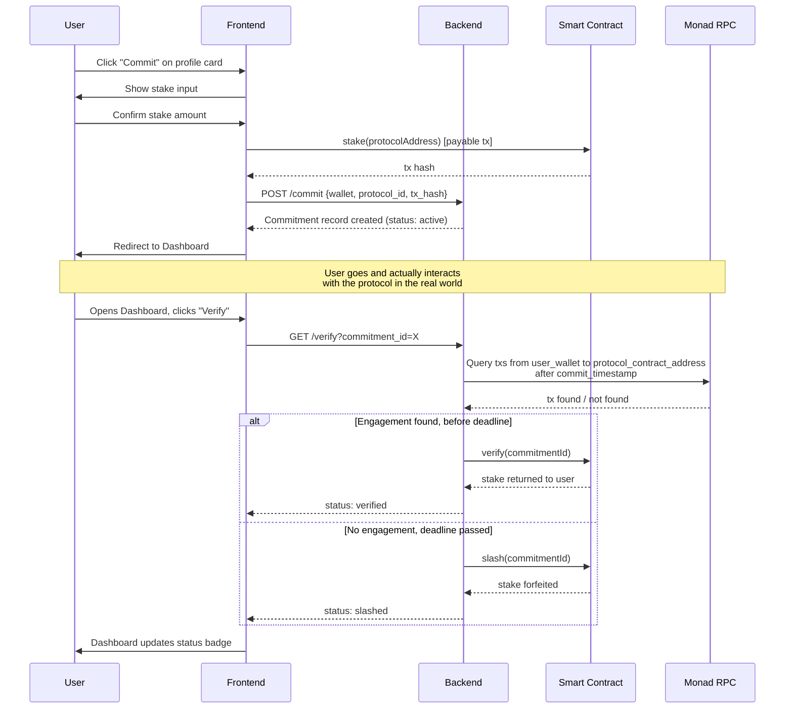

# KYP — Architecture

## Data Models

### Protocol Research Record

```json
{
  "id": "uuid",
  "input_raw": "whatever the user pasted (link/handle/text)",
  "name": "string",
  "chain": "monad",
  "network": "mainnet | testnet | unknown",
  "links": {
    "project": "url | null",
    "twitter": "url | null",
    "discord": "url | null",
    "github": "url | null"
  },
  "contract_address": "string | null",
  "score": 0,
  "score_max": 50,
  "who_its_for": "1-2 sentence string",
  "use_cases": ["string", "string"],
  "risks": {
    "contract": "string | null",
    "community": "string | null",
    "structural": "string | null"
  },
  "summary": "2-3 sentence string",
  "created_at": "timestamp",
  "created_by_wallet": "string"
}
```

`chain` is hardcoded to `"monad"` for this build — you're not building a multi-chain research tool tonight, but the field existing now means you don't have to do a schema migration later if KYP ever expands. `network` (mainnet/testnet) stays a separate field because a protocol's research profile doesn't change based on which environment its contract is deployed to.

### Commitment Record

```json
{
  "id": "uuid",
  "user_wallet": "string",
  "chain": "monad",
  "network": "testnet",
  "protocol_id": "uuid (fk -> research record)",
  "protocol_contract_address": "string",
  "staked_amount": "string (wei)",
  "stake_tx_hash": "string",
  "commit_timestamp": "timestamp",
  "verify_deadline": "timestamp (commit_timestamp + 72h)",
  "status": "active | verified | slashed",
  "verify_tx_hash": "string | null",
  "verified_at": "timestamp | null"
}
```

Same reasoning — `network` is hardcoded `"testnet"` for the hackathon build but present as a real field, not baked into logic, so switching to mainnet later is a config change, not a rewrite.

---

## System Flow — Research → Commit → Dashboard

```mermaid
flowchart TD
    A[User pastes link/handle] --> B[Frontend: Research screen]
    B --> C[POST /research]
    C --> D[Backend: Research Agent<br/>LLM + web lookup]
    D --> E[(Research Record<br/>stored in DB)]
    E --> F[Profile Card rendered:<br/>score, use cases, risks, who it's for]
    F --> G{User clicks Commit?}
    G -- No --> H[End: profile saved,<br/>viewable later]
    G -- Yes --> I[Frontend: Commit screen<br/>stake amount input]
    I --> J[Wallet prompts stake tx]
    J --> K[Smart Contract:<br/>stake&#40;protocolAddress&#41;]
    K --> L[POST /commit<br/>records tx hash]
    L --> M[(Commitment Record<br/>status: active)]
    M --> N[Dashboard: shows commitment<br/>with countdown to deadline]
    N --> O[Background/manual: GET /verify]
    O --> P{Onchain check:<br/>tx from user_wallet to<br/>protocol_contract_address<br/>after commit_timestamp?}
    P -- Yes, before deadline --> Q[Contract: verify&#40;&#41;<br/>stake returned]
    P -- No, deadline passed --> R[Contract: slash&#40;&#41;<br/>stake forfeited]
    Q --> S[(status: verified)]
    R --> T[(status: slashed)]
    S --> N
    T --> N
```



---

## Sequence — Commit + Verify (the part judges will actually click through)



---

## Component Map

| Layer | Responsibility | Talks to |
|---|---|---|
| Frontend (Vercel) | Research input, profile card, commit flow, dashboard | Backend API, wallet (via wagmi/viem), Monad RPC (read-only for balance/tx display) |
| Backend (Render) | `/research`, `/commit`, `/verify` endpoints; orchestrates LLM calls and RPC checks | LLM provider, Monad RPC, Firebase (auth), DB |
| Smart Contract (Monad Testnet) | `stake()`, `verify()`, `slash()` — holds funds, enforces state transitions | Called by backend (or directly by frontend wallet for `stake()`) |
| DB (research + commitment records) | Persists profiles and commitments | Backend only |

**One architectural decision to make explicitly:** does `verify()`/`slash()` get called by your backend (a trusted server wallet with permission to call these functions), or does the user call `verify()` themselves and the contract does the RPC check onchain via an oracle? For a 4-day build, **backend-triggered verify/slash is the right call** — a fully trustless onchain oracle is a rabbit hole you don't have time for, and "backend checks RPC, then calls the contract" is still a real, checkable onchain verification from the judge's perspective, not a self-report.
